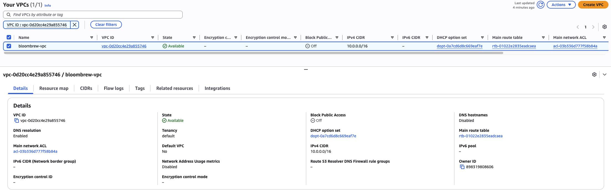
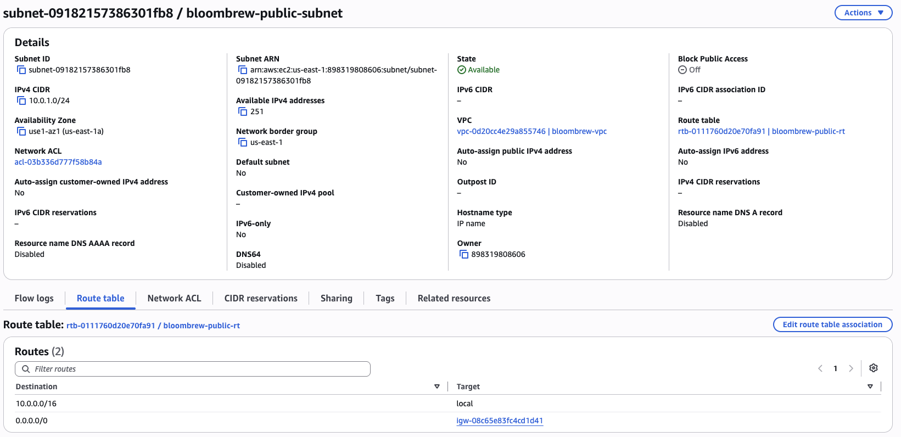
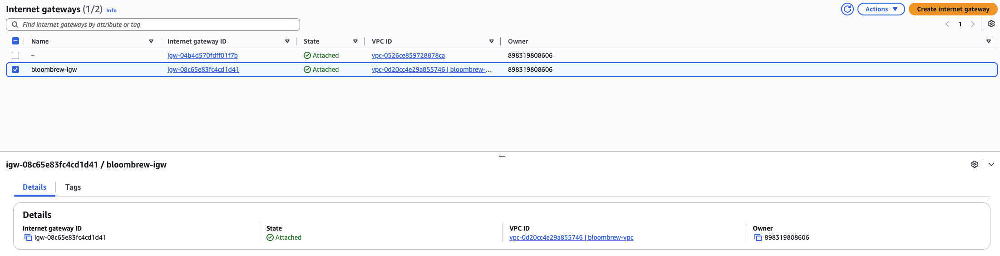
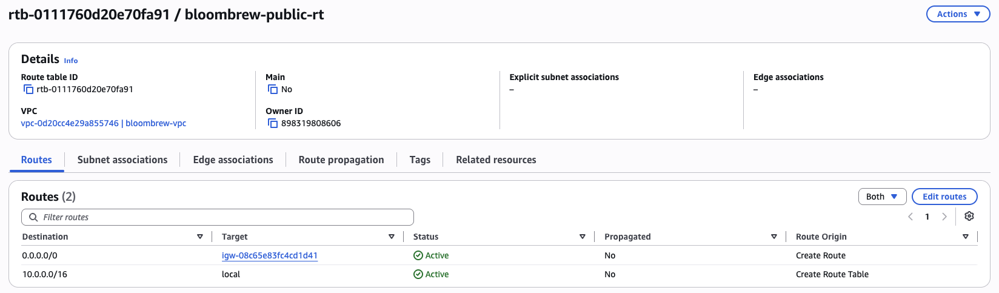
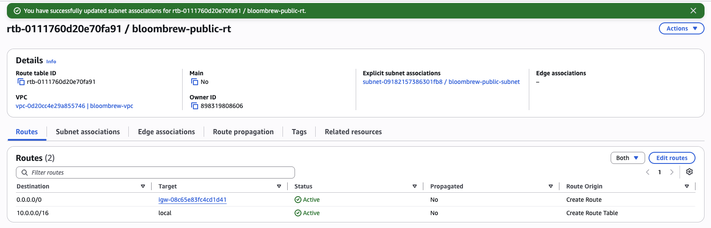
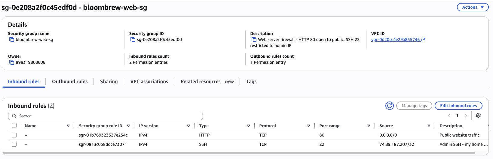

Phase 1 — Building the Network

Goal: Bloom & Brew's web server needs somewhere to live. Before launching any server, I built the network around it from scratch: an isolated VPC, a public subnet, a path to the internet, and a firewall. I deliberately avoided the default VPC that AWS provides — building each piece by hand meant I had to understand what each one actually does.

Architecture at the end of this phase
Internet
   |
[Internet Gateway: bloombrew-igw]
   |
VPC: bloombrew-vpc (10.0.0.0/16)
   |
Public Subnet: bloombrew-public-subnet (10.0.1.0/24, us-east-1a)
   - route table: bloombrew-public-rt (0.0.0.0/0 -> IGW)
   - firewall: bloombrew-web-sg (HTTP 80: world / SSH 22: my IP only)
1. VPC — bloombrew-vpc

Created a VPC with CIDR block 10.0.0.0/16 (~65,000 private addresses from the RFC 1918 private range). This is the isolated network boundary everything else lives inside — nothing gets in or out unless I explicitly build a path.

I left "VPC encryption control" off: it's a paid feature (AWS marks it with a ($)) and unnecessary for this project. Lesson learned early: read AWS's ($) markers like street signs.

2. Subnet — bloombrew-public-subnet

Carved a 10.0.1.0/24 subnet (256 addresses) out of the VPC's range, in availability zone us-east-1a. The subnet CIDR must sit inside the parent VPC CIDR — the console shows both fields stacked (IPv4 VPC CIDR block = the parent /16, IPv4 subnet CIDR block = my slice), which confused me for a minute until the parent/slice relationship clicked.

3. Internet Gateway — bloombrew-igw

Created an internet gateway and attached it to the VPC. The IGW is the door between the VPC and the internet — attaching it installs the door, but nothing flows until a route points at it (next step).

Honest note: I initially named this bloombrew-public-rt — the route table's name — because I was creating several objects in a row and crossed my wires. I only noticed when the page title looked wrong. Fixed in seconds via Manage tags, but it taught me that AWS "names" are just editable tags, and naming discipline matters when resources multiply.

4. Route Table — bloombrew-public-rt

Created a route table in the VPC and added one route: destination 0.0.0.0/0 (all addresses anywhere) → target: the internet gateway. Then associated the route table with my subnet.

The table has two routes:

Destination	Target	Meaning
10.0.0.0/16	local	traffic within the VPC (added automatically, can't be removed)
0.0.0.0/0	igw-…	everything else goes to the internet

This step is the answer to "what makes a subnet public": a subnet is public when it's associated with a route table that has a route to an internet gateway. Before I saved the association, the console showed my subnet pointing at the VPC's default "Main" route table (no internet route); after saving, it pointed at mine. I watched the subnet become public.

5. Security Group — bloombrew-web-sg

The instance-level firewall. Two inbound rules:

Port	Protocol	Source	Why
80 (HTTP)	TCP	0.0.0.0/0	it's a public website — the world is supposed to reach it
22 (SSH)	TCP	my IP /32	server administration is for me alone

Outbound: default allow-all.

AWS showed its yellow "0.0.0.0/0 allows all IP addresses" warning on this page. For port 80 that's not a mistake — it's the definition of a public website. The same source on port 22 would be a real problem, which is why SSH is pinned to a /32 (exactly one address: mine). Warnings need interpretation, not blind obedience.

Two things I learned on this screen: security groups are stateful (allowed-in traffic's replies are automatically allowed out — no reply rules needed) and deny-by-default (any port not explicitly opened is closed). And the create form has three description fields — one required for the whole group, plus an optional one per rule — which I discovered by filling in the wrong one first.

CIDR sizes I used today, smallest to biggest slash

/16 = the whole VPC (~65k addresses) → /24 = one subnet (256) → /32 = exactly one machine (my IP in the SSH rule). Same notation, three scopes — seeing all three in one afternoon made the concept stick.
