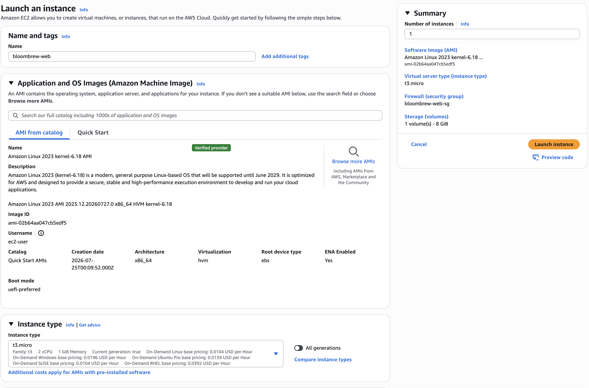
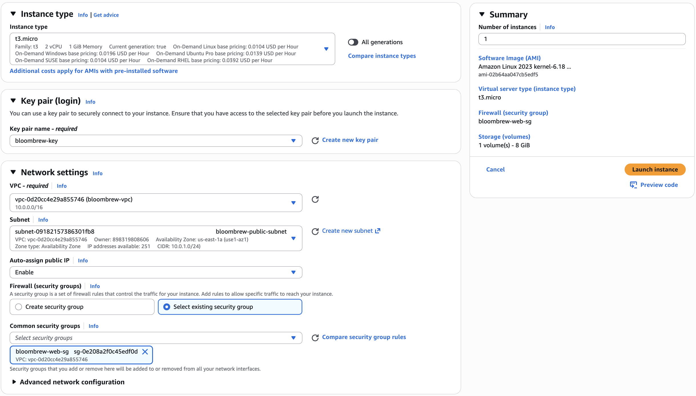
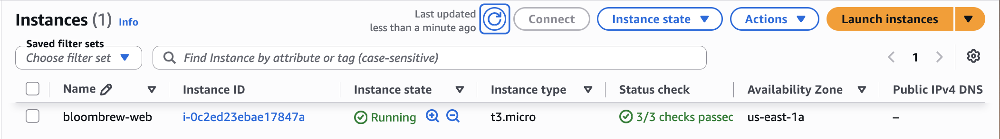
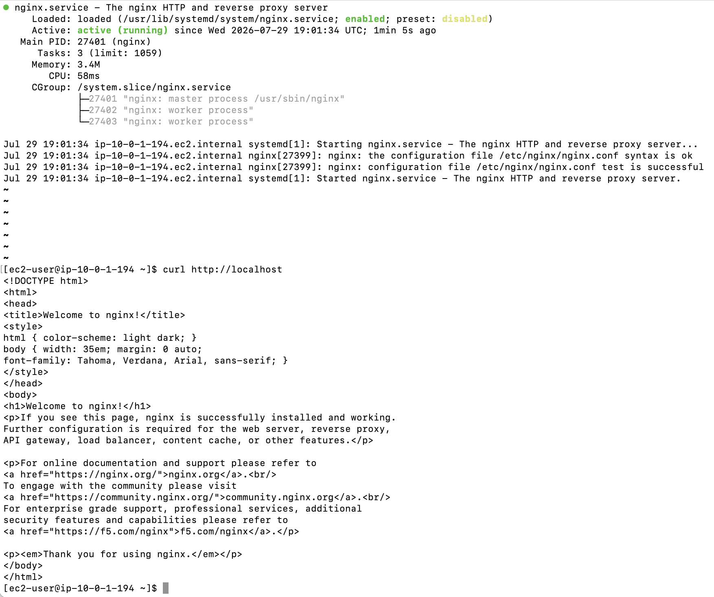
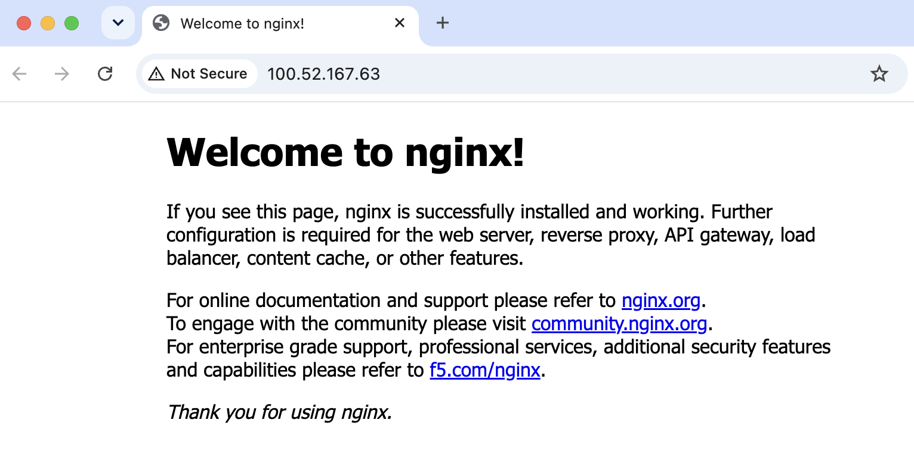
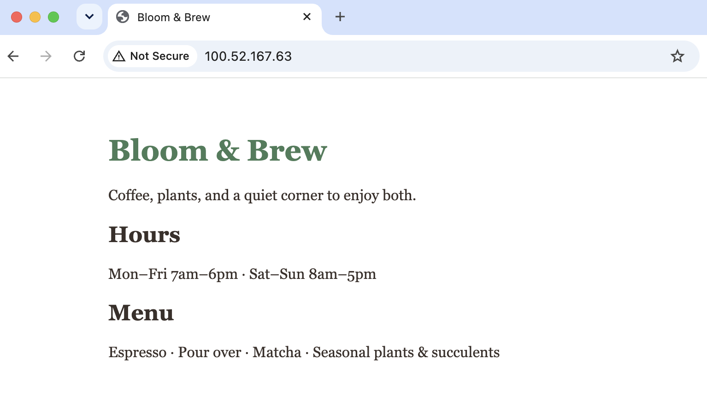
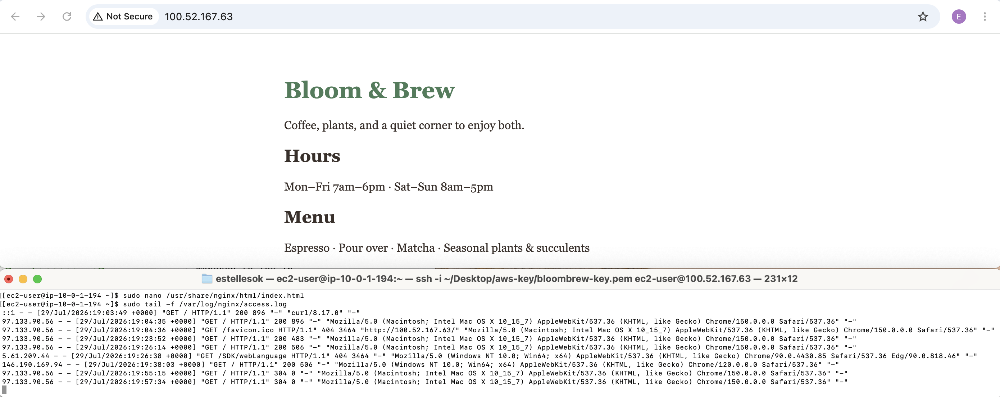

# Phase 2 — The Web Server

Goal: put Bloom & Brew's website on the internet. That means launching a real server (an EC2 instance) into the network from Phase 1, installing Nginx on it, and replacing the default page with the shop's site. This phase also produced my first real support ticket, before I ever managed to log in.

## 1. Launching the instance

Config, and why each choice:

- **AMI: Amazon Linux 2023 (kernel 6.18), x86.** AWS's own Linux, free to use. I picked x86 over Arm because the instance type I wanted is x86, and the two have to match.
- **Instance type: t3.micro.** 2 vCPU, 1 GiB memory. Plenty for a small site.
- **Key pair: bloombrew-key.** Created at launch, downloaded once. After the Day 1 password incident I moved the .pem somewhere deliberate immediately instead of leaving it in Downloads.
- **Network settings (the part that actually mattered):** my VPC, my public subnet, **Auto-assign public IP set to Enable**, and **Select existing security group** with bloombrew-web-sg. Two traps here. The subnet's default is no public IP, so leaving the toggle alone would give me a healthy server nobody could reach. And the launch form defaults to creating a brand new security group, which would have quietly bypassed the firewall I built in Phase 1.

Free tier side note: I went in looking for the "Free tier eligible" badge every tutorial mentions. It doesn't exist on my account. AWS changed the free tier in July 2025, and accounts created after that date get a credit-based plan ($100 in credits at signup, up to $200) instead of the old 12-month badge system. On the Free plan you can't actually be charged. Lesson: even tutorials about AWS describe an AWS that no longer exists, so check the date on everything.







## 2. Ticket #000: locked out before I ever got in

My first SSH attempt hung and timed out. Short version: my home IP had changed since I created the security group rule the day before, so the /32 SSH rule pointed at an address I no longer had, and the firewall silently dropped me. Fixing the rule got me one step further, to a new failure ("Connection closed"), which turned out to be the instance still finishing its boot. A plain retry got me in.

One unplanned incident, three distinct symptoms, each meaning something different:

| Symptom | Meaning | Layer to check |
|---|---|---|
| timed out | packets silently dropped | firewall (security group) |
| connection refused | machine answered, nothing listening on that port | the service |
| connection closed | server answered, then hung up mid-handshake | server side (here: still booting) |

Full write-up with screenshots: [ticket-000-ssh-lockout.md](../tickets/ticket-000-ssh-lockout.md)

## 3. Connecting with SSH

```
ssh -i ~/Desktop/aws-key/bloombrew-key.pem ec2-user@<public-ip>
```

Reading left to right: run ssh, identify with this private key (the server holds the matching public half, so there's no password), log in as ec2-user at this address. First connection asks you to trust the server's fingerprint, which is normal; the Mac remembers it afterward.

The prompt changing to `[ec2-user@ip-10-0-1-194 ~]$` was a small moment worth recording: 10.0.1.194 is an address from the subnet I built by hand in Phase 1. Everything typed after that runs on a machine in a Virginia data center.

Also learned the hard way that nano (and everything else on Linux) wants Ctrl, not Cmd. Cmd+O opened a Mac save dialog, which briefly made it look like a server program had opened a window on my laptop. It hadn't. The keystroke never left my Mac. Impossible-seeming behavior usually means you're blaming the wrong layer.

## 4. Installing Nginx

```
sudo dnf install nginx -y
sudo systemctl start nginx
sudo systemctl enable nginx
sudo systemctl status nginx
```

In order: install the web server, start it now, also start it on every future reboot, verify. The enable step is easy to skip and dangerous to skip: without it, a reboot brings the machine back with the website silently down.

Status came back active (running) in green, with the config test passing.



## 5. Verifying from inside, then outside

Two checks that answer two different questions:

```
curl http://localhost
```

This asks "is the application working?" while ignoring all networking. It returned the Nginx welcome HTML, so yes.

Then from my own browser: `http://<public-ip>` returned the same page. That asks "can the world reach it?" Also yes.

When these two answers ever disagree, the problem is network-layer, not the app. That single comparison is the fastest diagnostic move I've learned so far, and it's the backbone of a ticket coming later in this project.



## 6. Bloom & Brew goes live

Replaced the default page:

```
sudo nano /usr/share/nginx/html/index.html
```

That path is Nginx's document root, the folder it serves pages from. Whatever index.html contains is the website. Two real bugs on the way:

**Bug 1: the 44-line tell.** I pasted the new page without fully deleting the old one. Nano's save message said "Wrote 44 lines" when my page is about 18. Roughly double the expected number means old and new content are both in the file. Deleted everything (hold Ctrl+K to cut line after line) and repasted; the save said 18 and the browser agreed.

**Bug 2: mojibake.** The live page showed `Monâ€"Fri` and `·` instead of dashes and dots. Classic character-encoding problem: the page uses multi-byte UTF-8 characters but never declared its encoding, so the browser guessed wrong and printed the bytes individually. Fix is one line inside `<head>`:

```
<meta charset="utf-8">
```

Refresh, clean text. Now I know what mojibake looks like on sight.



## 7. Linux drill session

Time spent just poking at the running server, since these commands are the toolkit for the tickets ahead:

```
sudo tail -f /var/log/nginx/access.log   # watch visits arrive live
sudo cat /var/log/nginx/error.log        # where Nginx complains
ss -tlnp                                  # what's listening on which port
top                                       # live CPU/memory per process
df -h                                     # disk space
free -h                                   # memory
```

The access log one is worth doing with a browser open next to it: refresh the site and watch your own request appear with your IP, the timestamp, and status 200.



## Where things stand for the owner

Her site is live and fast. What she doesn't have yet: backups (Phase 3) and the "tell me before my customers notice" alerting (Phase 4). On schedule.
