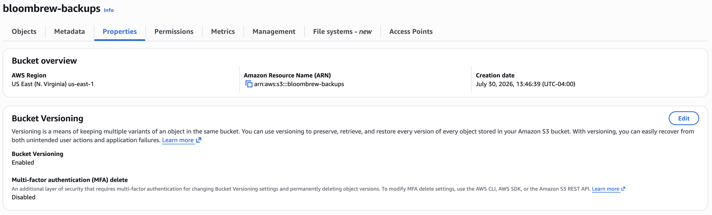
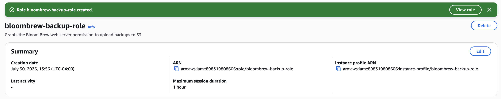
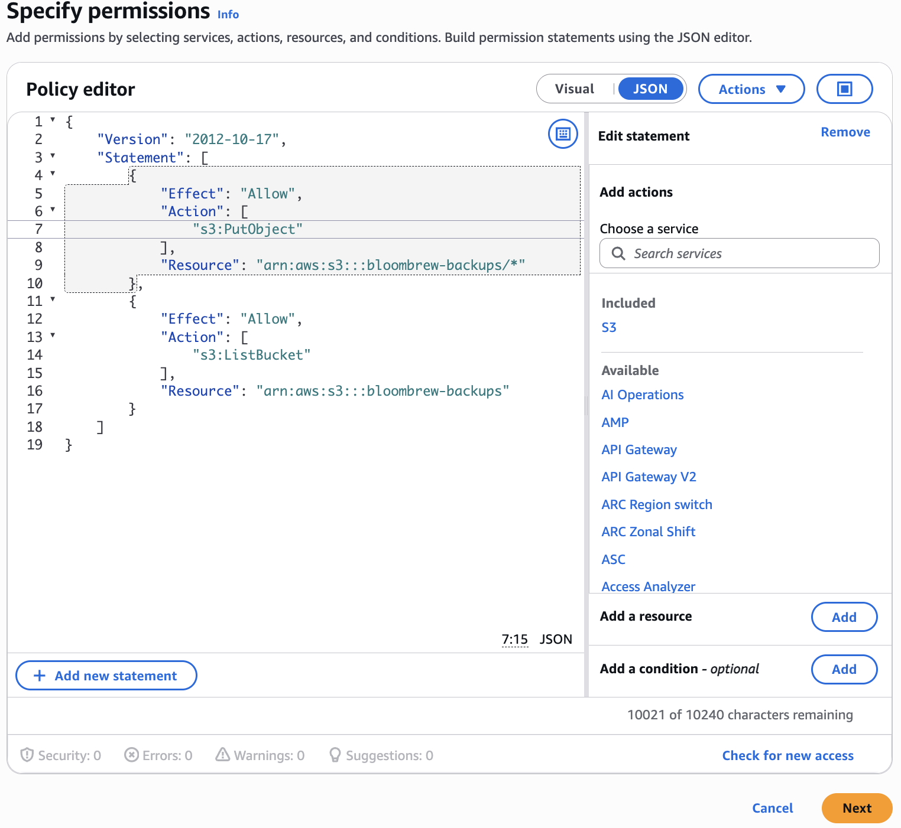
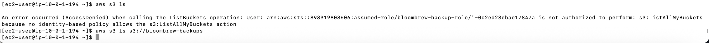
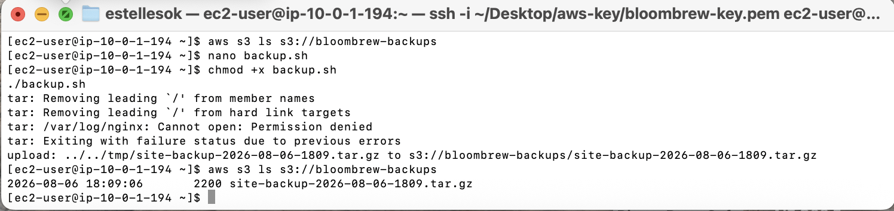
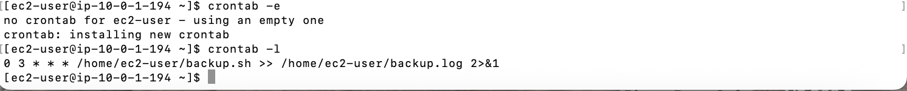
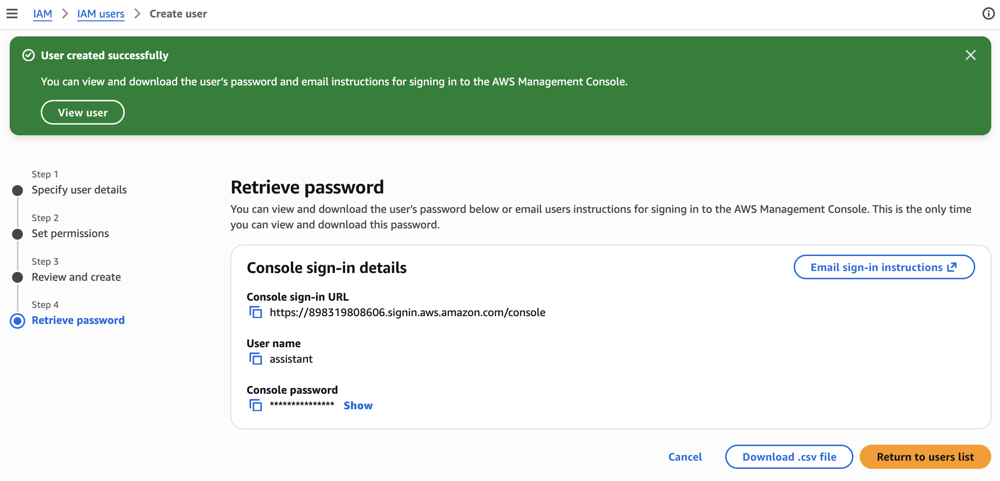
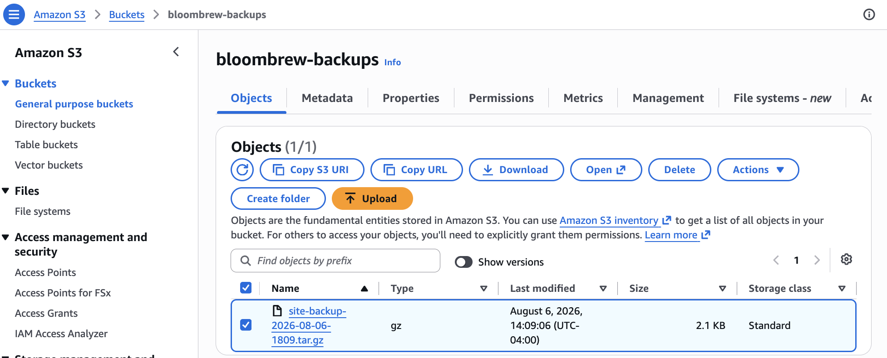
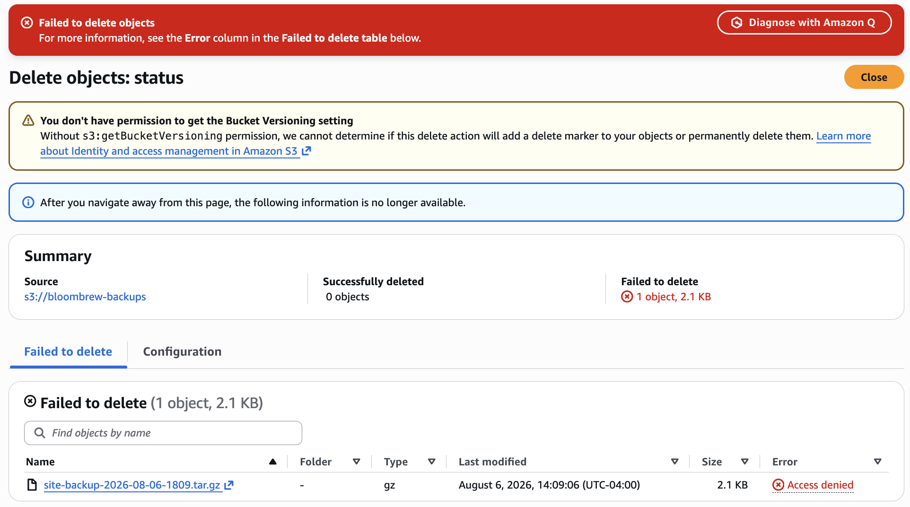
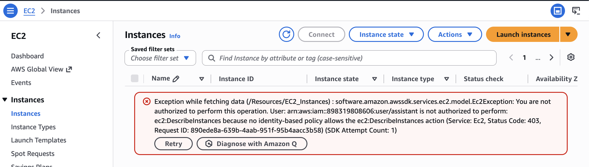

# Phase 3 — IAM and Backups

Goal: give Bloom & Brew's website automatic, unattended backups, and give the owner's assistant a way to check those backups without being able to touch anything else. This phase has two halves that turn out to be the same idea applied twice: a machine identity (the server) that can write backups, and a human identity (the assistant) that can only read them. Neither gets more than it needs.

## 1. The S3 bucket

Created a bucket to hold the backups: `bloombrew-backups`, in us-east-1, with Block all public access left on and Bucket Versioning enabled.

Block public access stays on because these are private backups, not something the internet should ever see. Versioning matters because it keeps every previous copy of a file instead of overwriting it, so a bad backup can't wipe out a good one underneath it.



## 2. The IAM role: what the server is allowed to do

This is where the concepts from the intro actually mattered. An IAM role is an identity a service wears, not a person, and I wanted the server to be able to upload backups without ever having a password or access key typed into it.

Created a role, `bloombrew-backup-role`, trusted by EC2, with this inline policy:

```json
{
  "Version": "2012-10-17",
  "Statement": [
    {
      "Effect": "Allow",
      "Action": ["s3:PutObject"],
      "Resource": "arn:aws:s3:::bloombrew-backups/*"
    },
    {
      "Effect": "Allow",
      "Action": ["s3:ListBucket"],
      "Resource": "arn:aws:s3:::bloombrew-backups"
    }
  ]
}
```

(Adapted from AWS's own IAM documentation on least-privilege S3 access. The syntax is standard; the part worth actually understanding is why it's shaped this way.)

The detail that matters here: the first ARN ends in `/*`, the second doesn't. PutObject acts on files inside the bucket, so it needs the `/*`. ListBucket acts on the bucket itself, so it doesn't. Different scope, different shape, same bucket.

Attached the role to the running EC2 instance under Actions → Security → Modify IAM role. No reboot, no downtime, no credentials typed anywhere.





**Why a role instead of an access key:** the tempting shortcut is generating an access key and pasting it onto the server. I didn't, on purpose. Keys on disk get stolen, leaked, or forgotten. A role gives the instance temporary, auto-rotating credentials with nothing to steal and nothing to rotate by hand.

### Proving it, not just trusting it

Ran `aws s3 ls` on the server to see if the role actually worked. It didn't, in an informative way:

```
An error occurred (AccessDenied) when calling the ListBuckets operation: User: arn:aws:sts::898319808606:assumed-role/bloombrew-backup-role/i-0c2ed23ebae17847a is not authorized to perform: s3:ListAllMyBuckets because no identity-based policy allows the s3:ListAllMyBuckets action
```

That error is actually good news read correctly. It confirms the role is attached and being used (the identity in the error is the role itself), and it confirms the policy is narrow on purpose: plain `aws s3 ls` asks to list every bucket on the whole account, which needs a much broader permission I never granted. The policy only allows working with one specific bucket. Asking it the right way instead:

```
aws s3 ls s3://bloombrew-backups
```

Silent success, no error. Denied for the broad ask, allowed for the narrow one, same session, same role. That contrast is the actual proof least privilege is working, not just written down in a JSON file.



## 3. The backup script

Why this matters at all: right now Bloom & Brew's site has exactly one copy, sitting on one server. If that server ever has a bad day, disk failure, an accidental delete, anything, the site is just gone with nothing to restore from. A backup is a second copy stored somewhere physically separate, so a problem on the server doesn't destroy the only copy of the business.

```bash
#!/bin/bash
# Bloom & Brew nightly backup
TIMESTAMP=$(date +%Y-%m-%d-%H%M)
tar -czf /tmp/site-backup-$TIMESTAMP.tar.gz /usr/share/nginx/html /var/log/nginx
aws s3 cp /tmp/site-backup-$TIMESTAMP.tar.gz s3://bloombrew-backups/
rm /tmp/site-backup-$TIMESTAMP.tar.gz
```

Line by line: `tar -czf` bundles the site's files and the Nginx logs into one compressed file, basically zipping a folder. `aws s3 cp` uploads that file using the role's borrowed credentials, no password typed, this is the exact moment the IAM work from earlier actually pays off. `rm` deletes the local copy afterward so the server's small disk doesn't slowly fill up with old backups nobody's watching.

Made it runnable and tested it:

```bash
chmod +x backup.sh
./backup.sh
aws s3 ls s3://bloombrew-backups
```

```
2026-08-06 18:09:06       2200 site-backup-2026-08-06-1809.tar.gz
```

A real backup, sitting in S3, uploaded with no credentials typed anywhere on the server.



## 4. Scheduling it with cron

Amazon Linux 2023 doesn't come with cron installed, which I didn't expect:

```
-bash: crontab: command not found
```

Installed and started it the same way as Nginx back in Phase 2:

```bash
sudo dnf install cronie -y
sudo systemctl start crond
sudo systemctl enable crond
```

(Small naming inconsistency worth knowing about: the package is cronie, the service is crond, and the command you actually type is crontab. Three different names for basically one thing.)

Then the actual schedule:

```bash
crontab -e
```

```
0 3 * * * /home/ec2-user/backup.sh >> /home/ec2-user/backup.log 2>&1
```

`0 3 * * *` means every day at 3:00 AM. The part after the script path sends both normal output and any errors into a log file. That logging matters more than it looks: without it, a backup that starts failing at 3 AM fails completely silently, with no record anywhere that anything went wrong. That exact scenario, a backup that's been failing for a while with nobody noticing, becomes its own ticket later in this project.



## 5. The assistant user: what a person is allowed to do

The owner's part-time assistant needs to check that backups exist. They don't need to delete one, and they definitely don't need to touch the server. So this is the same idea as the role, applied to a human instead of a machine, with a different, narrower set of verbs.

Created an IAM user, `assistant`, with console access and this policy:

```json
{
  "Version": "2012-10-17",
  "Statement": [
    {
      "Effect": "Allow",
      "Action": ["s3:GetObject"],
      "Resource": "arn:aws:s3:::bloombrew-backups/*"
    },
    {
      "Effect": "Allow",
      "Action": ["s3:ListBucket"],
      "Resource": "arn:aws:s3:::bloombrew-backups"
    }
  ]
}
```

Same shape as the role's policy, GetObject instead of PutObject, because this person reads backups and never writes them.



### Testing what assistant can't do, on purpose

Untested permissions are just permissions you're hoping about. So I logged in as assistant in a private browser window and tried to break my own rules.

**Reading a backup, should work:** had to switch the console to the right region first, and skip the general "all buckets" page, since browsing every bucket in the account needs a broader permission (ListAllMyBuckets) I never granted assistant either. Going straight to the one bucket by URL worked fine. Could see and download the file.



**Deleting a backup, should fail:** selected the file and tried to delete it. Got a warning first that assistant also can't check the bucket's versioning setting, another permission never granted, then the actual result:

```
Failed to delete: 1 object, 2.1 KB
Successfully deleted: 0 objects
Error: Access denied
```



**Viewing EC2, should fail:** tried to open the Instances page. Got the cleanest error message of this whole project:

```
User: arn:aws:iam::898319808606:user/assistant is not authorized to perform: ec2:DescribeInstances because no identity-based policy allows the ec2:DescribeInstances action (Service: Ec2, Status Code: 403)
```



Three for three. Read works, delete is blocked, EC2 is blocked. A policy that's only ever been read on a screen is a claim. A policy that's been tested against a real delete click and a real page load, and held both times, is actually proven.

## Where things stand for the owner

Her site now backs itself up every night without anyone touching it, and her assistant can check on those backups without being able to lose one, or wander into anything else. Still missing: the alert that tells her something's wrong before her customers do. That's next.
