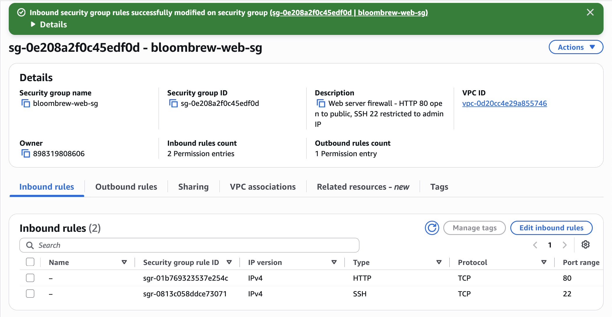
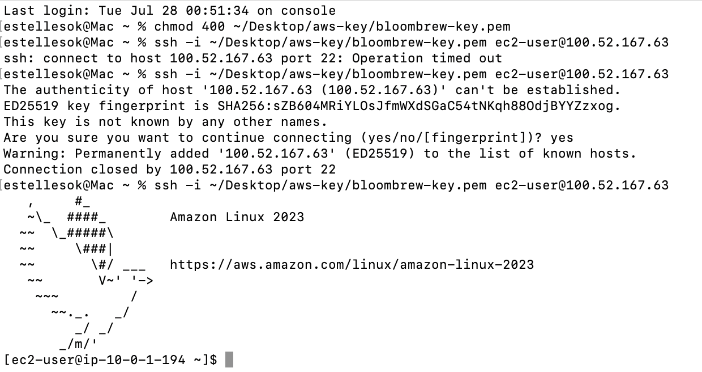

# Ticket #000 — "I can't even log in and I haven't done anything yet"

**Reported:** Day 2, first SSH attempt after launching the instance
**Severity:** High (blocking, since I couldn't start Phase 2 at all)
**Time to resolve:** about 15 minutes

This one wasn't planned. It's not one of the four scripted tickets from the project plan. It happened on its own, on my very first attempt to connect to the server I'd just launched, before I'd logged in even once.

## Symptoms

Ran the standard connect command:

```
ssh -i ~/Desktop/aws-key/bloombrew-key.pem ec2-user@100.52.167.63
```

Nothing happened for a while, then:

```
ssh: connect to host 100.52.167.63 port 22: Operation timed out
```

No error page, no rejection. Just silence, then a timeout.

## Troubleshooting steps

**1. Recognized the symptom type.** A timeout, as opposed to an instant "connection refused," usually means packets are going out but nothing is coming back. That's the signature of a firewall dropping traffic, not a service that's simply not running. So I looked at the security group before touching the server itself.

**2. Checked my current IP against the security group rule.** The SSH rule I'd created the day before was scoped to "My IP," which locks in whatever address you have at the moment you create the rule. It doesn't update itself afterward. I searched "what is my IP" and compared it to the address baked into the rule. They didn't match. Home internet providers reassign IPs often, and mine had apparently changed overnight.

**3. Fixed the rule.** EC2 console, then Security Groups, then bloombrew-web-sg, then Edit inbound rules. On the SSH row I reset Source to "My IP" again, which re-captures the current address, and saved.



**4. Retried the connection.** Got further this time, past the network layer entirely. The host's authenticity prompt showed up, which is normal for any first connection to a new server. I accepted it and got a new, different failure right after:

```
Connection closed by 100.52.167.63 port 22
```

That's a different kind of problem. The server actually answered and exchanged its identity, then hung up during the login handshake. So the firewall was no longer the issue since the packets clearly got there this time. The likely cause on a server that's only been running a few minutes is that it hadn't fully finished booting yet, even though the console already showed "Running."

**5. Retried again, no changes made.** This time it connected cleanly:

```
[ec2-user@ip-10-0-1-194 ~]$
```



## Root cause

Two separate issues stacked on top of each other. First, a stale IP-restricted security group rule, since my home IP had changed since the rule was created. Second, the instance was still completing its boot process when I retested the network path.

## Resolution

Updated the SSH rule's source to my current IP, then waited a bit and retried the connection once the instance had more time to finish initializing.

## Prevention

"My IP" rules aren't permanent. They capture an address at a single point in time. Any SSH rule scoped this way should probably be re-confirmed if a session ever refuses to connect, especially after a day has passed or the network has changed.

It's also worth giving a freshly launched instance a couple of extra minutes past "Running" before assuming SSH should already work. Status checks reaching 2/2 seems like a better readiness signal than the instance state alone.

The two symptoms I hit, timeout and then connection closed, turned out to mean completely different things. Timed out points at the network path. Connection refused points at "nothing listening on that port." Connection closed points at the server side of the handshake itself. Worth keeping these straight for future troubleshooting.

## What this taught me

I'd read about the timeout versus refused distinction in the project plan before ever touching a real server. It clicked properly the moment I hit an actual, unplanned timeout and had to reason through it live instead of just reciting it. This also ended up covering the same ground that the plan's scripted "Ticket #004" (SSH lockout) was going to teach later, except this version happened for real on day one of actually using the server, which honestly might be the better story anyway.
